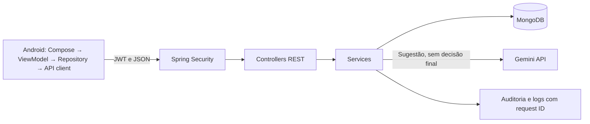

# INOVAGAB — Sprint 2

Aplicativo acadêmico de gestão do funil de inovação do Grupo Águia Branca. Operadores enviam ideias vinculadas a diretrizes estratégicas, Gestores avaliam ideias e projetos, e Líderes administram diretrizes e consultam indicadores. A [SPEC](SPEC-SPRINT2.md) registra o estado validado e a execução da Sprint 2.

## Tecnologias e arquitetura

| Camada | Tecnologias em uso                                                                                                                       |
| --- |------------------------------------------------------------------------------------------------------------------------------------------|
| Android | Kotlin 2.1.21, Jetpack Compose, Material Design 3, MVVM, StateFlow, Coroutines, Navigation Compose; cliente REST com `HttpURLConnection` |
| Backend | Java 21, Spring Boot 4.1.1, Spring MVC, Spring Security, JWT, Spring Data MongoDB, Validation, Actuator, Lombok                          |
| Dados | MongoDB 8 no Docker Compose local                                                                                                        |
| IA | Gemini `gemini-3.5-flash-lite` via backend, como sugestão para o Gestor                                                                  |
| Testes | JUnit, Spring Boot Test, Testcontainers para MongoDB                                                                                     |



O Android usa o backend para autenticação, diretrizes, ideias, prioridades, projetos e indicadores. Firebase não é necessário. A decisão manual do Gestor usa o PATCH de prioridade e os endpoints de aprovação/rejeição, independentemente da IA. A avaliação da IA é devolvida ao cliente sem alterar a pontuação ou a decisão gerencial persistida.

## Executar para avaliação acadêmica

1. Clone o repositório e entre na pasta: `git clone https://github.com/felipemm-santos/inovagab-sprint2.git` e `cd inovagab-sprint2`.
2. Instale JDK 21, Android Studio com Android SDK e Docker. Inicie o MongoDB na raiz com `docker compose up -d` (o `compose.yaml` usa MongoDB 8 na porta local 27017).
3. Configure a chave Gemini no mesmo PowerShell em que iniciará o backend:

```powershell
$env:GEMINI_API_KEY="SUA_CHAVE_AQUI"
echo $env:GEMINI_API_KEY
cd backend-api
.\mvnw.cmd spring-boot:run
```

4. Abra `android-app/` no Android Studio e execute `app` no emulador. O app usa `http://10.0.2.2:8080/api/v1`, endereço do backend local visto pelo emulador. Para dispositivo físico ou outro servidor, ajuste `BASE_URL` em `data/api/ApiClient.kt`; use HTTPS fora do ambiente local.
5. Entre com `gestor@aguiabranca.com.br` e senha `000000`, localize uma ideia aberta e toque em **Solicitar sugestão da IA**. Confira pontuação, prioridade, diretrizes e justificativa. Depois use a avaliação manual para definir a decisão do Gestor.

No perfil `local`, usuários acadêmicos são criados se ainda não existirem: `operador@aguiabranca.com.br`, `gestor@aguiabranca.com.br` e `lider@aguiabranca.com.br`, todos com senha `000000`. Estas são credenciais demonstrativas e podem ser substituídas pelas variáveis `DEMO_USERS_*`. Os atalhos na tela de login abrem as três telas para testes visuais; sem login, elas não carregam nem alteram dados protegidos.

Para validar:

```powershell
cd backend-api
.\mvnw.cmd test
cd ..\android-app
.\gradlew.bat assembleDebug
```

Os testes de integração backend usam Testcontainers e requerem Docker. O APK de depuração é gerado em `android-app/app/build/outputs/apk/debug/`.

## Configuração Gemini

No [Google AI Studio](https://aistudio.google.com/app/apikey), acesse **API Keys**, crie ou selecione um projeto, crie uma chave, copie-a e configure somente a variável `GEMINI_API_KEY` no ambiente do processo backend. A chave não pertence ao repositório ou ao Android. O modelo pode ser alterado com `GEMINI_MODEL` se necessário. O plano gratuito e os limites vigentes dependem da [tabela oficial de preços](https://ai.google.dev/gemini-api/docs/pricing).

Sem `GEMINI_API_KEY`, o backend inicia normalmente e apenas `POST /api/v1/ideas/{id}/ai-evaluation` retorna `503 AI_NOT_CONFIGURED`. Quota esgotada retorna `503 AI_QUOTA_EXCEEDED`; indisponibilidade/timeout e respostas inválidas geram erros controlados. A priorização manual continua disponível. Testes automatizados não chamam a API real.

## Perfis, dados e segurança

- `OPERADOR`: consulta diretrizes ativas e vigentes; cria ideia vinculada a uma delas; lista suas ideias; altera/exclui apenas próprias ideias ainda `SUBMITTED`.
- `GESTOR`: consulta diretrizes ativas e vigentes e todas as ideias; define prioridade e score de 0 a 100; aprova/rejeita com justificativa; gerencia projetos. Pode solicitar sugestão da IA, sem persistência automática da sugestão.
- `LIDER`: consulta e administra diretrizes, inclusive rascunhos e versões anteriores; consulta projetos e dashboard.

O backend é a fonte da verdade para permissões. JWT é enviado como `Authorization: Bearer <token>`, com sessão stateless e negação padrão. Senhas são armazenadas com BCrypt. Diretrizes usam exclusão lógica, histórico de versões e auditoria. Ideia aprovada gera um único projeto de forma idempotente. Erros REST incluem código e `requestId` para correlação. O perfil `prod` exige variáveis de MongoDB/JWT/porta; veja `backend-api/src/main/resources/application-prod.yml`.

## Endpoints principais

Todas as rotas abaixo já incluem o `context-path` `/api`. Objetos de erro usam `status`, `code`, `message` e `requestId`. Campos de data seguem ISO 8601.

| Método | Rota | Perfil | Request → response resumido |
| --- | --- | --- | --- |
| POST | `/api/v1/auth/login` | Público | `{email,password}` → `{accessToken,expiresAt,user:{id,name,email,role}}` |
| GET | `/api/v1/auth/me` | Autenticado | Sem corpo → usuário atual |
| POST | `/api/v1/auth/register` | Público | Dados do usuário → usuário `OPERADOR` |
| POST | `/api/v1/users` | `LIDER` | Dados e perfil → usuário criado |
| GET | `/api/v1/guidelines` | Autenticado | Sem corpo → lista filtrada pelo perfil |
| GET | `/api/v1/guidelines/{id}` | Autenticado | Sem corpo → diretriz e histórico, se visível |
| POST | `/api/v1/guidelines` | `LIDER` | `{title,description,category,campaign,status,validFrom,validUntil}` → diretriz versão 1 |
| PUT | `/api/v1/guidelines/{id}` | `LIDER` | Mesmo contrato do POST → diretriz atualizada, versão anterior em `history` |
| DELETE | `/api/v1/guidelines/{id}` | `LIDER` | Sem corpo → 204, exclusão lógica |
| POST | `/api/v1/ideas` | `OPERADOR` | `{title,description,category,strategicGuidelineId}` → ideia `SUBMITTED` |
| GET | `/api/v1/ideas/mine` | `OPERADOR` | Sem corpo → ideias do autor autenticado |
| GET | `/api/v1/ideas` | `GESTOR` | `?status=` opcional → lista de ideias |
| GET | `/api/v1/ideas/{id}` | `OPERADOR`, `GESTOR` | Sem corpo → ideia; Operador só acessa própria |
| PUT/DELETE | `/api/v1/ideas/{id}` | `OPERADOR` | Atualização ou exclusão de ideia própria `SUBMITTED` |
| PATCH | `/api/v1/ideas/{id}/priority` | `GESTOR` | `{priority,managerScore}` → ideia em `UNDER_REVIEW` |
| POST | `/api/v1/ideas/{id}/approve` | `GESTOR` | `{comment}` → `{idea,project,projectCreated}` |
| POST | `/api/v1/ideas/{id}/reject` | `GESTOR` | `{comment}` → ideia `REJECTED` |
| POST | `/api/v1/ideas/{id}/ai-evaluation` | `GESTOR` | Sem corpo → `{score,priority,strategyIds,reason}`; sugestão não persistida |
| GET | `/api/v1/projects` e `/{id}` | `GESTOR`, `LIDER` | Filtro `?status=` opcional → projetos com resultados e ROI |
| POST/PUT | `/api/v1/projects` e `/{id}` | `GESTOR` | `{strategicGuidelineId,name,description,status,stage,startDate,expectedEndDate,investment,financialReturn,costReduction,productivityGain}` → projeto |
| DELETE | `/api/v1/projects/{id}` | `GESTOR` | Sem corpo → 204, exclusão lógica |
| GET | `/api/v1/dashboard/summary` | `LIDER` | Sem corpo → indicadores agregados |
| GET | `/api/v1/dashboard/projects/{id}` | `LIDER` | Sem corpo → indicadores do projeto |
| GET | `/api/v1/dashboard/strategies/{id}` | `LIDER` | Sem corpo → indicadores da diretriz |

Prioridades válidas: `LOW`, `MEDIUM`, `HIGH`, `CRITICAL`. Status de diretriz: `DRAFT`, `ACTIVE`, `ARCHIVED`. A IA considera apenas diretrizes ativas e vigentes do MongoDB, valida score, prioridade e IDs retornados, e deixa a decisão final para o Gestor.
