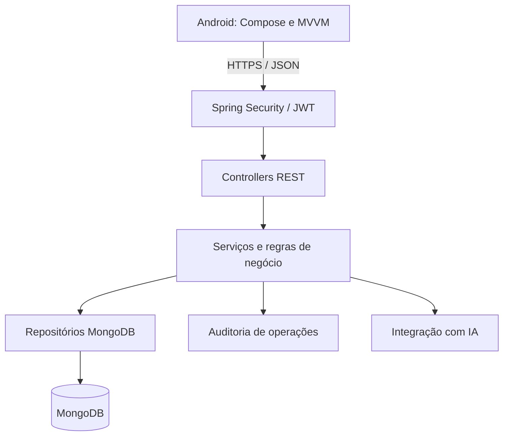

# INOVAGAB — Sprint 2

Plataforma de gestão do funil de inovação do Grupo Águia Branca, desenvolvida no Challenge FIAP. Conecta colaboradores que propõem ideias, gestores que avaliam iniciativas e líderes que acompanham resultados.

Este repositório reúne o aplicativo Android e o backend da Sprint 2. A entrega da Sprint 1 permanece em um repositório separado.

> **Status:** estruturação inicial do backend e preparação da integração. As funcionalidades da Sprint 2 descritas abaixo são objetivos de implementação, não uma declaração de que já estão disponíveis. As instruções devem ser atualizadas conforme os incrementos forem validados.

## Objetivo

Evoluir a solução da Sprint 1 para uma aplicação integrada a uma API REST em Java, com persistência MongoDB, autenticação, autorização por perfil, auditoria e observabilidade.

O aplicativo anterior utiliza Firebase Authentication e Firebase Realtime Database. A Sprint 2 prevê a migração dos fluxos para o novo backend, preservando a experiência Android e transferindo as regras críticas para o servidor.

## Perfis e funcionalidades previstas

| Perfil | Responsabilidades |
| --- | --- |
| Operador | Consultar diretrizes, cadastrar ideias e acompanhar suas próprias submissões. |
| Gestor | Consultar diretrizes, avaliar e priorizar ideias, aprovar iniciativas e gerenciar projetos e resultados. |
| Líder | Gerenciar diretrizes estratégicas, consultar projetos e acompanhar indicadores no dashboard. |

As permissões devem ser verificadas no backend, incluindo a propriedade dos registros. Restrições de navegação no Android não substituem autorização na API.

## Tecnologias

| Componente | Tecnologias definidas |
| --- | --- |
| Aplicativo Android | Kotlin, Jetpack Compose, Material Design 3, MVVM, StateFlow e Coroutines |
| Backend | Java 21, Spring Boot 4.1.1 e Maven |
| Segurança | Spring Security e autenticação JWT a implementar |
| Persistência | MongoDB e Spring Data MongoDB |
| Código e validação | Lombok e Jakarta Bean Validation |
| Observabilidade | Spring Boot Actuator, logs e auditoria a configurar |
| IA | Integração planejada para apoiar a pontuação e priorização de ideias; provedor a definir |

As versões efetivas devem ser conferidas no `backend-api/pom.xml` e nos arquivos Gradle do Android. O backend utiliza Spring Data MongoDB, não JPA/Hibernate.

## Organização do repositório

| Caminho | Conteúdo |
| --- | --- |
| `android-app/` | Projeto Android, incluindo Gradle Wrapper. |
| `backend-api/` | Projeto Spring Boot, incluindo `pom.xml`, código-fonte e Maven Wrapper. |
| `.gitignore` | Regras compartilhadas para arquivos locais, segredos e resultados de build. |
| `.gitattributes` | Padronização de arquivos de texto e quebras de linha. |
| `README.md` | Visão geral e orientações para a equipe. |

O pacote raiz definido para o backend é `br.com.fiap.inovagab`. A organização prevista é por funcionalidade, com módulos como `auth`, `user`, `guideline`, `idea`, `project`, `dashboard` e `audit`, separando controllers, serviços, DTOs, documentos e repositórios.

Não inicialize repositórios Git separados dentro de `android-app/` ou `backend-api/`. O controle de versão pertence à raiz do monorepositório.

## Arquitetura alvo



Este diagrama representa a arquitetura planejada. A IA deve atuar como apoio à decisão; a aprovação das ideias continua sob responsabilidade do Gestor.

## Preparação do ambiente

- Git instalado e acesso ao repositório.
- JDK 21 para o backend.
- IntelliJ IDEA ou outra IDE compatível com Java e Maven.
- Android Studio, Android SDK e emulador ou dispositivo físico.
- MongoDB acessível, localmente ou em ambiente remoto.
- Docker para execulação do banco em contêiner.

O JDK usado pelo Gradle do Android deve respeitar a configuração do aplicativo; não altere sua versão automaticamente por causa do backend.

### Obter o código

```powershell
git clone https://github.com/felipemm-santos/inovagab-sprint2.git
Set-Location inovagab-sprint2
```

Se o nome remoto for diferente, utilize a URL fornecida pelo GitHub.

### Backend

Abra `backend-api/` no IntelliJ IDEA como projeto Maven e selecione o JDK 21. No PowerShell, a partir da raiz:

```powershell
Set-Location backend-api
java -version
.\mvnw.cmd --version
```

Antes de executar, configure a conexão MongoDB e as propriedades exigidas pela aplicação. A configuração de ambientes, os nomes das variáveis e as credenciais de desenvolvimento ainda serão definidos; não há um Docker Compose validado documentado nesta etapa.

Após configurar os serviços necessários:

```powershell
# Executar os testes disponíveis
.\mvnw.cmd test

# Iniciar a aplicação
.\mvnw.cmd spring-boot:run
```

Os comandos são os pontos de entrada do Maven Wrapper, não evidências de que a integração já foi testada. A disponibilidade de endpoints depende da implementação, da configuração do banco e das regras de segurança.

### Aplicativo Android

1. Abra `android-app/` no Android Studio.
2. Aguarde a sincronização do Gradle e instale os componentes de SDK solicitados pelo projeto.
3. Configure os serviços ainda utilizados pela versão do app, incluindo Firebase enquanto a migração não estiver concluída. Obtenha a configuração com a equipe, sem compartilhar credenciais no README.
4. Selecione um emulador ou dispositivo físico e execute o módulo `app`.
5. Quando a integração REST estiver implementada, configure o endereço do backend no local definido pelo aplicativo.

Para gerar um APK de depuração pelo PowerShell, a partir da raiz:

```powershell
Set-Location android-app
.\gradlew.bat assembleDebug
```

O endereço da API, a política de conexão do ambiente de desenvolvimento e os requisitos de rede serão documentados junto à integração. Em produção, utilizar HTTPS.

## Segurança e configuração

- Não versionar senhas, tokens, chaves privadas, arquivos `.env` com valores reais ou chaves de assinatura do Android.
- Manter exemplos de configuração sem segredos e documentar as variáveis quando forem implementadas.
- Um arquivo `.env` não é carregado automaticamente pelo Spring Boot: seu carregamento precisa ser configurado explicitamente ou substituído por variáveis do ambiente/IDE.
- Armazenar senhas com hash seguro; não reutilizar as senhas demonstrativas da Sprint 1.
- Validar JWT e permissões no servidor. O aplicativo não deve decidir o papel de um usuário.
- Evitar tokens, senhas e dados pessoais desnecessários nos logs.
- Preservar Maven Wrapper e Gradle Wrapper no Git para permitir builds reproduzíveis.

## Planejamento da Sprint 2

### Base e integração

- [ ] Estruturar Spring Boot, Spring Security, Spring Data MongoDB e Lombok.
- [ ] Configurar MongoDB e ambientes de execução.
- [ ] Implementar autenticação e autorização para os três perfis.
- [ ] Integrar os fluxos Android ao backend e substituir os acessos anteriores conforme a migração.

### Funcionalidades

- [ ] Completar o CRUD de diretrizes, incluindo edição pelo Líder.
- [ ] Permitir consulta de diretrizes pelo Gestor e pelo Operador.
- [ ] Registrar histórico das estratégias, com data, categoria e campanha.
- [ ] Implementar gestão de ideias vinculadas às estratégias.
- [ ] Implementar avaliação e priorização de ideias pelo Gestor.
- [ ] Preservar no backend a conversão de ideia aprovada em projeto, prevenindo duplicidades.
- [ ] Implementar gestão de projetos, progresso e resultados vinculados às estratégias.
- [ ] Disponibilizar indicadores agregados por projeto e estratégia para o dashboard.

### Qualidade e entrega

- [ ] Implementar validação, tratamento de erros e testes.
- [ ] Configurar logs, auditoria e métricas.
- [ ] Integrar IA para apoiar pontuação e priorização de ideias.
- [ ] Documentar endpoints: método, rota, payload, resposta e permissões.
- [ ] Atualizar o diagrama conforme a arquitetura implementada.
- [ ] Preparar código-fonte, APK, apresentação e demonstração prevista no plano da equipe.

As caixas indicam pendências ainda não verificadas nesta documentação. Atualizá-las somente após implementação e validação.

## Colaboração

Trabalhar em branches por tarefa e revisar as alterações antes de integrá-las à `main`.

Exemplo para iniciar uma tarefa, com a árvore de trabalho limpa:

```powershell
git switch main
git pull --ff-only
git switch -c chore/estrutura-backend
```

Antes de cada commit, revisar `git status` e `git diff`. Após adicionar os arquivos desejados, revisar também `git diff --cached` para evitar publicar segredos ou alterações não relacionadas. O `.gitignore` não remove arquivos já rastreados.

Prefixos sugeridos: `feat`, `fix`, `chore`, `docs` e `test`.

**Integrantes: ** Aurélio | André | Danilo | Felipe | Victor
