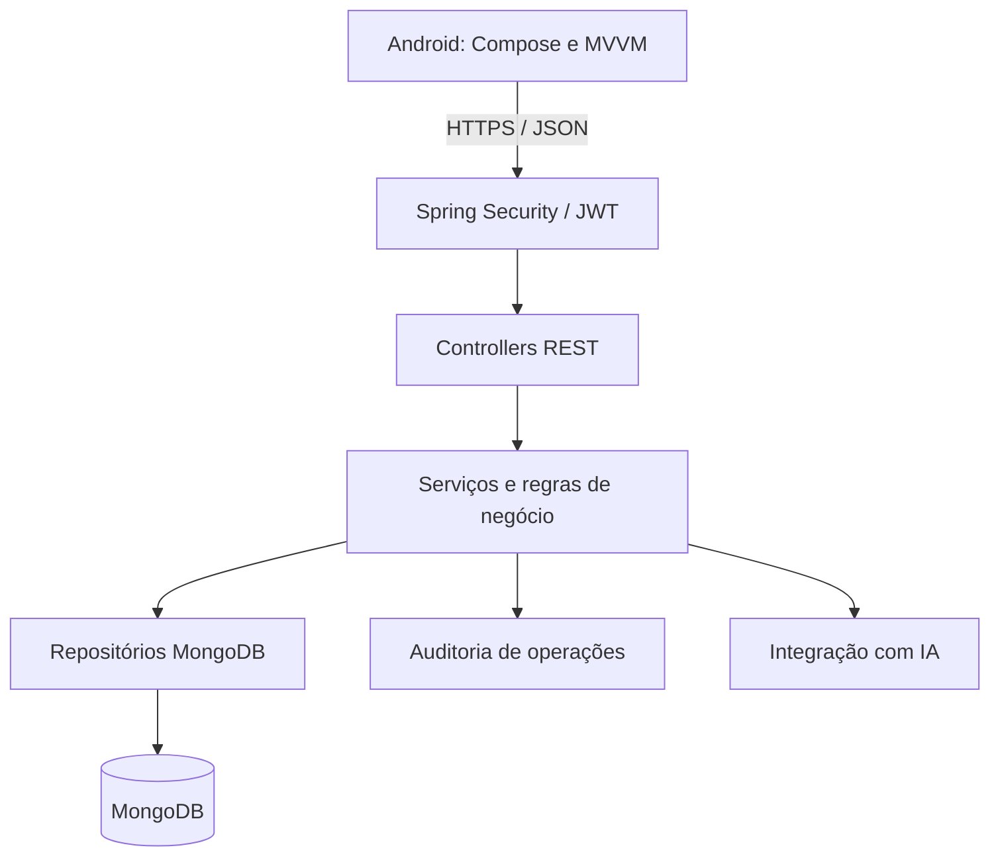

# INOVAGAB — Sprint 2

Plataforma de gestão do funil de inovação do Grupo Águia Branca, desenvolvida no Challenge FIAP. Conecta colaboradores que propõem ideias, gestores que avaliam iniciativas e líderes que acompanham resultados.

Este repositório reúne o aplicativo Android e o backend da Sprint 2. A entrega da Sprint 1 permanece em um repositório separado.

> **Status:** persistência MongoDB, autenticação JWT, autorização por perfil e APIs de diretrizes, ideias, projetos e dashboard implementadas no backend. A integração do Android com a API continua em desenvolvimento.

O INOVAGAB é um projeto acadêmico do curso de Análise e Desenvolvimento de Sistemas da FIAP. A
configuração local prioriza facilidade de execução e demonstração, sem deixar de aplicar boas práticas como hash de senha, autorização no backend e separação entre os perfis `local` e `prod`.

## Objetivo

Evoluir a solução da Sprint 1 para uma aplicação integrada a uma API REST em Java, com persistência MongoDB, autenticação, autorização por perfil, auditoria e observabilidade.

O aplicativo anterior utiliza Firebase Authentication e Firebase Realtime Database. A Sprint 2 prevê a migração dos fluxos para o novo backend, preservando a experiência Android e transferindo as regras críticas para o servidor.

## Perfis e funcionalidades previstas

| Perfil | Responsabilidades |
| --- | --- |
| Operador | Consultar diretrizes, cadastrar ideias e acompanhar suas próprias submissões. |
| Gestor | Consultar diretrizes, avaliar e priorizar ideias, aprovar iniciativas e gerenciar projetos e resultados. |
| Líder | Gerenciar diretrizes estratégicas, consultar projetos e acompanhar indicadores no dashboard. |

As permissões devem ser verificadas no backend, incluindo a propriedade dos registros. Restrições de navegação no Android não substituem autorização na API.

## Tecnologias

| Componente | Tecnologias definidas |
| --- | --- |
| Aplicativo Android | Kotlin, Jetpack Compose, Material Design 3, MVVM, StateFlow e Coroutines |
| Backend | Java 21, Spring Boot 4.1.1 e Maven |
| Segurança | Spring Security, BCrypt e autenticação JWT stateless |
| Persistência | MongoDB e Spring Data MongoDB |
| Código e validação | Lombok e Jakarta Bean Validation |
| Observabilidade | Spring Boot Actuator, logs e auditoria a configurar |
| IA | Integração planejada para apoiar a pontuação e priorização de ideias; provedor a definir |

As versões efetivas devem ser conferidas no `backend-api/pom.xml` e nos arquivos Gradle do Android. O backend utiliza Spring Data MongoDB.

## Organização do repositório

| Caminho | Conteúdo |
| --- | --- |
| `android-app/` | Projeto Android, incluindo Gradle Wrapper. |
| `backend-api/` | Projeto Spring Boot, incluindo `pom.xml`, código-fonte e Maven Wrapper. |
| `.gitignore` | Regras compartilhadas para arquivos locais, segredos e resultados de build. |
| `.gitattributes` | Padronização de arquivos de texto e quebras de linha. |
| `README.md` | Visão geral e orientações para a equipe. |

O pacote raiz definido para o backend é `br.com.fiap.inovagab`. A organização prevista é por funcionalidade, com módulos como `auth`, `user`, `guideline`, `idea`, `project`, `dashboard` e `audit`, separando controllers, serviços, DTOs, documentos e repositórios.

Não inicialize repositórios Git separados dentro de `android-app/` ou `backend-api/`. O controle de versão pertence à raiz do monorepositório.

## Arquitetura alvo



Este diagrama representa a arquitetura planejada. A IA deve atuar como apoio à decisão; a aprovação das ideias continua sob responsabilidade do Gestor.

## Preparação do ambiente

- Git instalado e acesso ao repositório.
- JDK 21 para o backend.
- IntelliJ IDEA ou outra IDE compatível com Java e Maven.
- Android Studio, Android SDK e emulador ou dispositivo físico.
- MongoDB acessível, localmente ou em ambiente remoto.
- Docker para execulação do banco em contêiner.

O JDK usado pelo Gradle do Android deve respeitar a configuração do aplicativo; não altere sua versão automaticamente por causa do backend.

### Obter o código

```powershell
git clone https://github.com/felipemm-santos/inovagab-sprint2.git
Set-Location inovagab-sprint2
```


### Backend

Abra `backend-api/` no IntelliJ IDEA como projeto Maven e selecione o JDK 21. No PowerShell, a partir da raiz:

```powershell
Set-Location backend-api
java -version
.\mvnw.cmd --version
```

O perfil padrão é `local`. Seu arquivo `application-local.yml` é versionado e já contém valores
padrão para MongoDB, JWT e usuários de demonstração. Cada valor também pode ser substituído por
variável de ambiente, mas nenhuma configuração adicional é necessária para a execução padrão com o Docker Compose do projeto.

A partir da raiz do repositório, inicie o MongoDB e depois o backend:

```powershell
# Na raiz do projeto
docker compose up -d

Set-Location backend-api

# Executar os testes disponíveis
.\mvnw.cmd test

# Iniciar a aplicação
.\mvnw.cmd spring-boot:run
```

### Perfis de configuração

| Perfil | Comportamento |
| --- | --- |
| `local` | Usa valores padrão versionados e aceita sobrescrita por variáveis de ambiente. Cria os três usuários acadêmicos se ainda não existirem. |
| `test` | Usa MongoDB do Testcontainers e configuração JWT exclusiva dos testes. |
| `prod` | Não possui valores padrão para porta, MongoDB ou JWT; exige `SERVER_PORT`, `MONGODB_URI`, `JWT_SECRET`, `JWT_ISSUER` e `JWT_EXPIRATION`. |


### Aplicativo Android

1. Abra `android-app/` no Android Studio.
2. Aguarde a sincronização do Gradle e instale os componentes de SDK solicitados pelo projeto.
3. Configure os serviços ainda utilizados pela versão do app, incluindo Firebase enquanto a migração não estiver concluída. Obtenha a configuração com a equipe, sem compartilhar credenciais no README.
4. Selecione um emulador ou dispositivo físico e execute o módulo `app`.
5. Quando a integração REST estiver implementada, configure o endereço do backend no local definido pelo aplicativo.

Para gerar um APK de depuração pelo PowerShell, a partir da raiz:

```powershell
Set-Location android-app
.\gradlew.bat assembleDebug
```

O endereço da API, a política de conexão do ambiente de desenvolvimento e os requisitos de rede serão documentados junto à integração. Em produção, utilizar HTTPS.

## Segurança e configuração

- Não versionar credenciais reais, tokens ou chaves privadas. As credenciais acadêmicas abaixo são fictícias e foram versionadas intencionalmente para facilitar a demonstração.
- As senhas são persistidas somente como hash BCrypt com fator de custo 12 e nunca são retornadas pelos DTOs.
- Os perfis reconhecidos são `OPERADOR`, `GESTOR` e `LIDER`; eles são obtidos do banco e incluídos no JWT assinado.
- O cadastro público cria exclusivamente `OPERADOR`. Somente um `LIDER` autenticado pode cadastrar usuários com outro perfil.
- O JWT é enviado no cabeçalho `Authorization: Bearer <token>`, possui expiração configurável e é validado quanto à assinatura, emissor e validade.
- A API usa sessão stateless e nega por padrão qualquer rota que não possua uma regra explícita.
- Evitar tokens, senhas e dados pessoais desnecessários nos logs.
- Preservar Maven Wrapper e Gradle Wrapper no Git para permitir builds reproduzíveis.

### Endpoints de autenticação e usuários

Com o `context-path` atual, todas as URLs abaixo recebem o prefixo `/api`:

| Método | Rota | Acesso | Finalidade |
| --- | --- | --- | --- |
| `POST` | `/api/v1/auth/register` | Público | Cadastra um usuário `OPERADOR`. |
| `POST` | `/api/v1/auth/login` | Público | Valida as credenciais e retorna o access token. |
| `GET` | `/api/v1/auth/me` | Autenticado | Retorna os dados atuais do usuário do token. |
| `POST` | `/api/v1/users` | `LIDER` | Cadastra `OPERADOR`, `GESTOR` ou `LIDER`. |

### Credenciais padrão

No perfil `local`, os usuários abaixo são criados automaticamente caso seus e-mails ainda não estejam cadastrados:

| Perfil | E-mail | Senha |
| --- | --- | --- |
| Operador - Base | `operador@aguiabranca.com.br` | `000000` |
| Gestor - Tático | `gestor@aguiabranca.com.br` | `000000` |
| Líder - Executivo | `lider@aguiabranca.com.br` | `000000` |

Os valores podem ser substituídos pelas variáveis `DEMO_USERS_PASSWORD`, `DEMO_OPERATOR_EMAIL`, `DEMO_MANAGER_EMAIL` e `DEMO_LEADER_EMAIL`. Para desativar a criação automática, defina `DEMO_USERS_ENABLED=false`.

O inicializador não altera usuários já existentes. Se a senha de um usuário demonstrativo for modificada no banco, a aplicação preservará a alteração nas próximas inicializações.

O logout desta etapa é realizado descartando o access token no aplicativo. Como ainda não há refresh token nem lista de revogação, um novo login será necessário após a expiração.

Erros de autenticação são retornados em JSON com `status`, `code`, `message`, `path` e `timestamp`. Os códigos principais são `INVALID_CREDENTIALS`, `AUTHENTICATION_REQUIRED`, `INVALID_TOKEN` e `ACCESS_DENIED`.

### Endpoints de negócio

Todas as rotas abaixo usam o prefixo `/api` definido pelo `context-path`.

| Método | Rota | Acesso | Finalidade |
| --- | --- | --- | --- |
| `GET` | `/api/v1/guidelines` | Autenticado | Líder consulta todas as diretrizes não excluídas; demais perfis recebem somente as ativas e vigentes. |
| `GET` | `/api/v1/guidelines/{id}` | Autenticado | Consulta uma diretriz respeitando visibilidade e vigência. |
| `POST` | `/api/v1/guidelines` | `LIDER` | Cria uma diretriz. |
| `PUT` | `/api/v1/guidelines/{id}` | `LIDER` | Atualiza uma diretriz e preserva a versão anterior no histórico. |
| `DELETE` | `/api/v1/guidelines/{id}` | `LIDER` | Realiza exclusão lógica e arquiva a diretriz. |
| `POST` | `/api/v1/ideas` | `OPERADOR` | Cadastra uma ideia para o usuário autenticado. |
| `GET` | `/api/v1/ideas/mine` | `OPERADOR` | Lista somente as ideias do usuário autenticado. |
| `GET` | `/api/v1/ideas/{id}` | `OPERADOR`, `GESTOR` | Operador consulta apenas ideia própria; Gestor pode consultar qualquer ideia. |
| `PUT` | `/api/v1/ideas/{id}` | `OPERADOR` | Atualiza uma ideia própria enquanto estiver em `SUBMITTED`. |
| `DELETE` | `/api/v1/ideas/{id}` | `OPERADOR` | Exclui uma ideia própria enquanto estiver em `SUBMITTED`. |
| `GET` | `/api/v1/ideas` | `GESTOR` | Lista todas as ideias, com filtro opcional `status`. |
| `PATCH` | `/api/v1/ideas/{id}/priority` | `GESTOR` | Define prioridade e pontuação gerencial. |
| `POST` | `/api/v1/ideas/{id}/approve` | `GESTOR` | Aprova a ideia e cria um único projeto de forma idempotente. |
| `POST` | `/api/v1/ideas/{id}/reject` | `GESTOR` | Rejeita uma ideia com justificativa. |
| `GET` | `/api/v1/projects` | `GESTOR`, `LIDER` | Lista projetos, com filtro opcional `status`. |
| `GET` | `/api/v1/projects/{id}` | `GESTOR`, `LIDER` | Consulta projeto, resultados, lucro e ROI. |
| `POST` | `/api/v1/projects` | `GESTOR` | Cria um projeto manual. |
| `PUT` | `/api/v1/projects/{id}` | `GESTOR` | Atualiza planejamento, andamento e resultados. |
| `GET` | `/api/v1/dashboard/summary` | `LIDER` | Retorna indicadores consolidados de todos os projetos. |
| `GET` | `/api/v1/dashboard/projects/{projectId}` | `LIDER` | Retorna indicadores financeiros e operacionais de um projeto. |
| `GET` | `/api/v1/dashboard/strategies/{guidelineId}` | `LIDER` | Retorna os indicadores consolidados dos projetos vinculados à diretriz. |

As requisições de escrita usam DTOs validados. Datas de término não podem anteceder datas de início, valores financeiros não podem ser negativos e decisões sobre ideias exigem justificativa. O `authorId` e o `managerId` são obtidos do JWT, não do corpo enviado pelo cliente.

Projetos não possuem exclusão física na API. Para preservar histórico e indicadores, o Gestor deve atualizar o status para `CANCELLED` quando uma iniciativa for encerrada sem conclusão.

O dashboard calcula os indicadores no backend. O lucro corresponde ao retorno financeiro menos o investimento, e o ROI geral usa os totais consolidados em vez da média dos ROIs individuais. Quando o investimento é zero, o ROI é `null` e a resposta informa o motivo. Um projeto é considerado atrasado quando o prazo esperado já passou e seu status não é `COMPLETED` nem `CANCELLED`. As durações médias são retornadas em dias; a duração real considera somente projetos concluídos com data de início e conclusão disponíveis.

As respostas de erro incluem um `requestId`, também devolvido no cabeçalho `X-Request-Id`, para correlação com os logs. Os principais códigos de negócio são `GUIDELINE_NOT_FOUND`, `GUIDELINE_NOT_ACTIVE`, `IDEA_NOT_FOUND`, `IDEA_ACCESS_DENIED`, `INVALID_IDEA_STATUS`, `PROJECT_NOT_FOUND`, `INVALID_ID` e `VALIDATION_ERROR`.

## Planejamento da Sprint 2

### Base e integração

- [x] Estruturar Spring Boot, Spring Security, Spring Data MongoDB e Lombok.
- [x] Configurar MongoDB e ambientes de execução.
- [x] Implementar autenticação e autorização para os três perfis.
- [ ] Integrar os fluxos Android ao backend e substituir os acessos anteriores conforme a migração.

### Funcionalidades

- [x] Completar o CRUD de diretrizes, incluindo edição pelo Líder.
- [x] Permitir consulta de diretrizes pelo Gestor e pelo Operador.
- [x] Registrar histórico das estratégias, com data, categoria e campanha.
- [x] Implementar gestão de ideias vinculadas às estratégias.
- [x] Implementar avaliação e priorização de ideias pelo Gestor.
- [x] Preservar no backend a conversão de ideia aprovada em projeto, prevenindo duplicidades.
- [x] Implementar gestão de projetos, progresso e resultados vinculados às estratégias.
- [x] Disponibilizar indicadores agregados por projeto e estratégia para o dashboard.

### Qualidade e entrega

- [x] Implementar validação, tratamento de erros e testes para autenticação e módulos de negócio.
- [x] Configurar logs de requisição, request ID, auditoria de operações e métricas do Actuator.
- [ ] Integrar IA para apoiar pontuação e priorização de ideias.
- [ ] Documentar endpoints: método, rota, payload, resposta e permissões.
- [ ] Atualizar o diagrama conforme a arquitetura implementada.
- [ ] Preparar código-fonte, APK, apresentação e demonstração prevista no plano da equipe.

As caixas indicam pendências ainda não verificadas nesta documentação. Atualizá-las somente após implementação e validação.

## Colaboração

Trabalhar em branches por tarefa e revisar as alterações antes de integrá-las à `main`.

Exemplo para iniciar uma tarefa, com a árvore de trabalho limpa:

```powershell
git switch main
git pull --ff-only
git switch -c chore/estrutura-backend
```

Antes de cada commit, revisar `git status` e `git diff`. Após adicionar os arquivos desejados, revisar também `git diff --cached` para evitar publicar segredos ou alterações não relacionadas. O `.gitignore` não remove arquivos já rastreados.

Prefixos sugeridos: `feat`, `fix`, `chore`, `docs` e `test`.

**Integrantes: ** Aurélio | André | Danilo | Felipe | Victor
