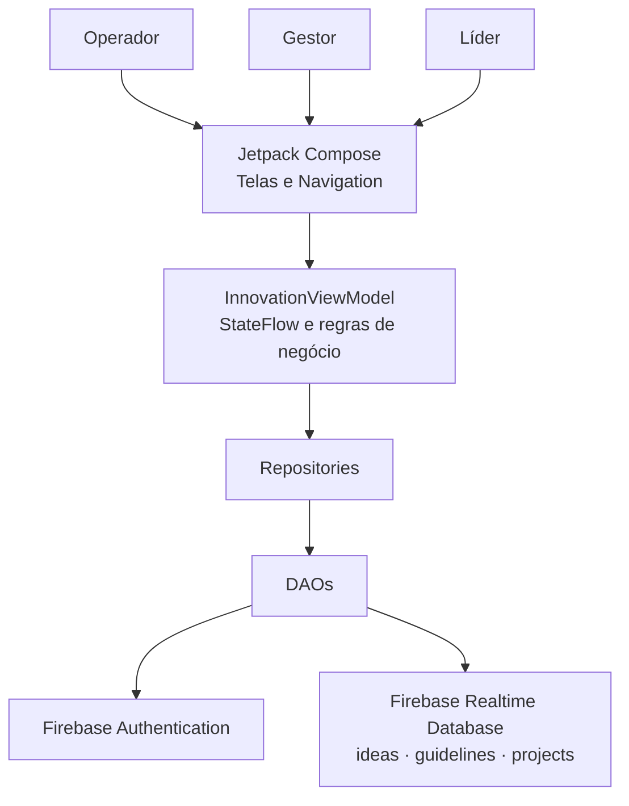

# INOVAGAB - Plataforma de Inovação Corporativa 🚀

Aplicativo Android nativo desenvolvido para a gestão do funil de inovação do Grupo Águia Branca. O sistema implementa uma arquitetura reativa que conecta a base operacional (motoristas, cobradores) à liderança estratégica, permitindo o registro de dores, ideação, curadoria tática e acompanhamento de ROI em tempo real.

## 🌟 Inovação Aplicada (Diferenciais)
Para promover o engajamento e a eficiência, implementamos:
* **Automação de Fluxos:** Ideias aprovadas pelo gestor são automaticamente convertidas e alocadas como "Projetos Corporativos" no banco de dados.
* **Filtros Dinâmicos:** Uso de *FilterChips* para categorização instantânea das dores na visão do Operador.
* **Dashboard Reativo:** As métricas financeiras (ROI) e o ganho de produtividade na visão do Líder são agregados matematicamente (`sumOf`, `average`) em tempo real, sem necessidade de recarregar a tela.

---

## 🛠️ Stack Tecnológico e Arquitetura

Este projeto foi construído utilizando as ferramentas e padrões mais modernos do ecossistema

Android nativo:

* **Linguagem:** Kotlin
* **UI Toolkit:** Jetpack Compose (UI Declarativa) com Material Design 3
* **Arquitetura:** MVVM (Model-View-ViewModel) para separação clara de responsabilidades entre interface e lógica de negócios.
* **Gerenciamento de Estado (State Management):** `StateFlow` e `MutableStateFlow` nativos do Kotlin, garantindo que a UI (View) reaja instantaneamente a qualquer mutação na camada de dados.
* **Assincronismo:** Kotlin Coroutines (`suspend functions` e `viewModelScope`) para garantir que as requisições ao repositório não bloqueiem a Main Thread (UI Thread).
* **Navegação:** Jetpack Navigation Compose para roteamento de telas e passagem de estado.
* **Autenticação:** Firebase Authentication para controle de acesso seguro.
* **Persistência de Dados:** Firebase Realtime Database para armazenamento de dados em nuvem e sincronização em tempo real.

---

## Arquitetura e Fluxo da Aplicação

O Operador registra ideias e consulta diretrizes. O Gestor prioriza e avalia
ideias, acompanha projetos e consulta diretrizes. O Líder administra as
diretrizes e acompanha os indicadores do portfólio.

---

## 🚀 Como Executar e Configurar o Emulador

Para testar o aplicativo sem erros de renderização ou quebras visuais no Windows, é fundamental utilizar uma imagem de sistema Android estável.

1. Abra o Android Studio e acesse o **Device Manager**.
2. Clique em **Create Virtual Device** e escolha **Pixel 7** ou **Pixel 8**.
3. **[ATENÇÃO]** Na seleção de *System Image*, **NÃO** utilize a API 37 (Pre-Release/Experimental), pois causa bugs de renderização (black screen) no host.
4. Escolha uma versão estável consolidada, como a **API 35 (Android 15)** ou **API 34 (Android 14)** com suporte a Google Play Intel x86_64.
5. Após finalizar a criação, inicie o AVD, aguarde o boot completo e execute o projeto (Run / `Shift + F10`).

---

## 🔑 Credenciais de Acesso (Testes)

O sistema possui controle de roteamento condicional baseado na triagem de perfil do usuário validado via Firebase. Utilize as credenciais embutidas para acessar as diferentes visões do app:

* 👷 **Perfil Operador (Base):** `operador@aguiabranca.com.br`
* 👔 **Perfil Gestor (Tático):** `gestor@aguiabranca.com.br`
* 📊 **Perfil Líder (Executivo):** `lider@aguiabranca.com.br`

**Senha padrão para todos os perfis:** `000000`

---

## 📂 Estrutura do Projeto e Responsabilidades

A codebase segue a estruturação modular focada no MVVM:

### 1. Camada de Dados (`data`)
* **`model/InnovationModels.kt`:** Data classes que mapeiam as entidades do sistema: `UserRole` (Enum), `InnovationIdea` (inputs da base operacional com data de criação e homologação), `StrategicGuideline` (diretrizes macro) e `CorporateProject` (projetos aprovados com consolidação financeira).
* **`dao/`:** Classes DAO (Data Access Object) que realizam as operações diretas de leitura e escuta no Firebase.
* **`repository/`:** Classes intermediárias entre os DAOs e a ViewModel, separando a camada de acesso aos dados das regras de negócio.
* **`FirebaseProvider.kt`:** Objeto Singleton que inicializa e provê a conexão global com o Firebase Realtime Database.

### 2. Camada Lógica e de Estado (`ui/viewmodel`)
* **`InnovationViewModel.kt`:** Classe que estende `ViewModel`. Centraliza a regra de negócio do funil de inovação. Mantém os `StateFlows` públicos que são coletados (observados) pela UI através do `collectAsState()`.

### 3. Camada de Interface Declarativa (`ui/screens`)
* **`LoginScreen.kt`:** Componente Compose de entrada. Implementa validação de formulário controlada por estado e comunicação com o Firebase Auth, além de rotas de atalho (Deep links internos) para testes ágeis de avaliação.
* **`OperadorDashboardScreen.kt`:** Painel operacional. Utiliza `LazyRow` para o componente de *FilterChip* e `LazyColumn` com pesos (*weight*) distribuídos para listagem performática de ideias cadastradas.
* **`GestorDashboardScreen.kt`:** Visão tática com duas `LazyColumns` assíncronas. Integra componentes do Material 3 (`AlertDialog`) para realizar mutações de estado no painel de acompanhamento financeiro.
* **`LiderDashboardScreen.kt`:** Dashboard executivo. Reage dinamicamente aos inputs do Gestor para montar um painel de indicadores (KPIs).

### 4. Camada de Roteamento (`ui/navigation`)
* **`Screen.kt`:** Classe `sealed` utilizada para definir o contrato tipado das rotas de navegação (*type-safety*).
* **`InovaGabNavGraph.kt`:** Define o container `NavHost` do Navigation Compose, injetando o `NavController` e orquestrando as trocas de contexto e fluxo de *Logout*.

### 5. Configuração e Bootstrap (Root & `ui/theme`)
* **Theme (`Color.kt`, `Theme.kt`, `Type.kt`):** Tokens de design padronizados baseados no Material 3.
* **`MainActivity.kt`:** O *Entry Point* do ciclo de vida Android. Inicializa o contexto principal (`setContent`), aplica a `Surface` base e provê a injeção manual da `InnovationViewModel` para a árvore de navegação.
